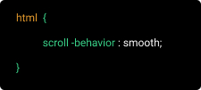

# Simple Landing Page

## Description 
This project was made independently and without any starter code. It is made with HTML, CSS and JavaScript, following a series of lectures on the theme “JavaScript & the DOM”.

## General info
The project required me to build a landing page that uses JavaScript to create an interactive navigational.

## Landing Page Behavior

* Navigation is built dynamically as an unordered list - Manipulating the DOM exercise.
* Section Active State - It should be clear which section is being viewed while scrolling through the page.
* Scroll to Anchor - When clicking an item from the navigation menu, the link should scroll to the appropriate section.
* Adding a scroll to top button on the page that’s only visible when the user scrolls below the fold of the page.

## Preview the website live on : [DEMO](https://carolinafledgling.github.io/Simple-Landing-Page-/)

## Screenshots

## Code Examples

* `document.createDocumentFragment()` The DocumentFragment interface is a lightweight version of the Document that stores a piece of document structure like a standard document. DocumentFragment isn’t part of the active DOM tree ,any changes in document fragment, it doesn't affect the document or performance.

👉 More info: [DocumentFragment](https://developer.mozilla.org/en-US/docs/Web/API/DocumentFragment?fbclid=IwAR1MqMUEumETf5qHSclfQxLIIcJj2sQ7YgGiGoovXNW9VNcU6PX-vjqQBU4-/)

* `behavior: 'smooth'` there is a native CSS feature for this: scroll-behavior 

  

_For browsers that do not support the scroll-behavior property, you can use JavaScript or a JavaScript library, like jQuery, to create a solution that will work for all browsers_

`document.querySelector('.hello').scrollIntoView({ behavior: 'smooth' })`

👉 More info: [smooth scroll behavior](http://iamdustan.com/smoothscroll/)

* `performance.now()` - The standard way to measure how long it takes code to run is by using `performance.now()`. It  returns a timestamp that is measured in milliseconds.

👉 More info: [Testing Code Performance](https://developer.mozilla.org/en-US/docs/Web/API/Performance/now)

